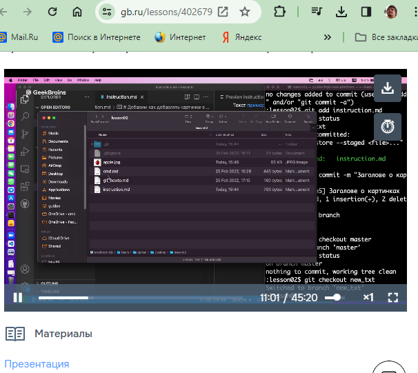

# Инструкция для работы с маркдаун

## Основные команды

### Создать репозиторий
```sh
git init
```
### Узнать статус
```sh
git status
```

### Добавить изменения
```sh
git add <имя файла>
```

### Коментарий к изменению
```sh
git commit -m "коментарий"
```

### Вызвать список сохранений 
```sh
git log
```

### Укороченый список сохранений
```sh
git log --oneline
```

### Откатить к сохранению
```sh
git checkout <имя сохранения>
```
### Откатить к главному сохранению
```sh
git checkout master
```

### Вызов списка вкток в репозиторий
```sh
git branch
```

### Создать новую ветку
```sh
git branch (имя новой ветки)gi
```

### Удаление ветки
```sh
git branch -d (имя ветки)
```

### Переход с одной ветки на другую
```sh
git checkout (имя ветки)
```

### Команда для переноса (слияния) веток, например из черновика в чистовик.
```sh
git merge (имя ветки)
```


## Заголовки

Для того чтобы выделить заголовок, нужно поставить перед текстом решетку (#)

# Заголовок1
## Заголовок2
### Заголовок3


## Выделение текста
 Чтобы выделить текст курсивом необходимо обрамить его звездочками (**) или знаками нижнего подчеркивания (__)
 *Пример*
 
 _Пример_

 Чтобы выделить текст полужирным нужно обрамить его двумя звездочками  (**) или знаком нижнего подчеркивания (__)
 **Пример**

 __Пример__

 Альтернативные способы выделения текста жирным или курсивном для того чтобы мы могли совмещать эти два способа.
 
(_**)
  
 _Например, текст может быть выделен курсивом и при этом быть **полужирным**_

## Списки
Чтобы выделить ненумерованый список, используйте (*)

Чтобы добавить **ненумерованный** список- необходимо перед пунктом ставить звездочку (* пример) или знаком (+)
* пункт1
* пункт2
* пункт3
+ пункт4

Чтобы добавить  **пронумерованые** списки необходимо пронумеровать пункты
(1. пример)
1. пункт1
2. пункт2
3. пункт3


## Работа с изображениями

Чтобы вставить изображения в текст достаточно написать следующее:


## Web ссылки

Текст [пример ссылки](http.example.com "Всплывающая подсказка")

## Цитирование

> Первый уровень цитирования
>> Второй уровень цитирования

вставить картинку

новый текст


# Создаем несколько ветвей
## Для домашнего задания к уроку №4

создал 4 ветки

Созданная ветка 1 для урегулирования конфликта первого уровня (редактирование текста)

создаем конфликт 2го уровня (редакция текста в ветке V2 и master с последующим слиянием)

Конфликт 3го уровня (Создаем ветку в ветке и редактируем её) (добавили немного текста)

vetka 4

# Домашнее задание
## Работа с Удаленными репозиториями в git

### Команда для клонирования внешнего репозитория на наш ПК
```sh
git clone (адрес репозитория, ссылка с гит хаб)
```
### Команда для стягивания изменений из гитхаба на локальный гит
```sh
git pull 
```
### Команда для отправки с локального гита на гитхаб
```sh
git push
```
